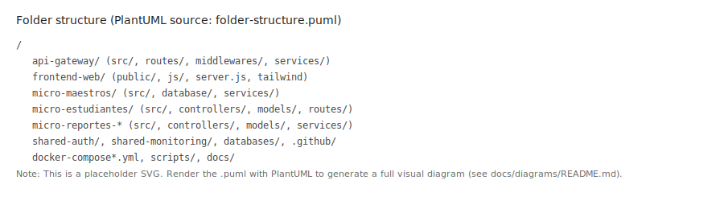
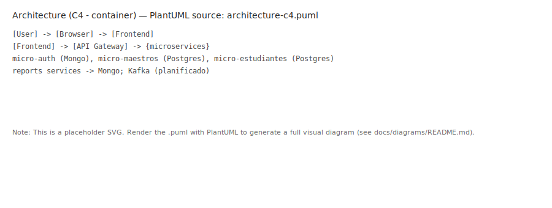
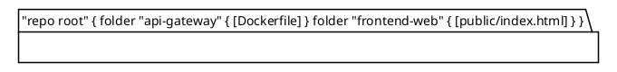

# Informe Técnico-Académico del Proyecto: Sistema de Acompañamiento Académico

**Nombre del Proyecto:** Sistema de Acompañamiento Académico  
**Tipo de Proyecto:** Sistema distribuido basado en microservicios  
**Dominio:** Educativo  
**Fecha de Análisis:** 17 de diciembre de 2025  
**Fecha de actualización:** 22 de diciembre de 2025
**Autor del Informe:** Arquitecto de Software Senior, Ingeniero DevOps, Analista de Sistemas y Redactor Técnico Académico  

---

## 1. DESARROLLA UN INFORME COMPLETO DEL PROYECTO

### Introducción

El Sistema de Acompañamiento Académico representa una solución tecnológica integral diseñada para facilitar la gestión y seguimiento de procesos educativos en instituciones de enseñanza superior. Este proyecto se concibe como una plataforma distribuida que integra múltiples microservicios para abordar las necesidades de estudiantes, maestros y administradores en un entorno académico dinámico. La arquitectura se fundamenta en principios de microservicios, permitiendo una escalabilidad horizontal y una mantenibilidad modular.

El sistema se desarrolla bajo un enfoque de ingeniería de software moderna, incorporando prácticas DevOps, contenedorización con Docker y una infraestructura preparada para despliegues en la nube. La implementación combina tecnologías frontend y backend robustas, con énfasis en la seguridad, el rendimiento y la experiencia del usuario.

### Planteamiento del Problema

En el contexto educativo actual, las instituciones enfrentan desafíos significativos en la gestión de procesos académicos, incluyendo:

- **Falta de integración entre sistemas:** Los sistemas legacy existentes operan de manera aislada, generando silos de información y dificultades en la toma de decisiones.
- **Escalabilidad limitada:** Las soluciones monolíticas no pueden adaptarse eficientemente al crecimiento de la población estudiantil y la complejidad de los procesos académicos.
- **Seguridad insuficiente:** La gestión de datos sensibles (calificaciones, información personal) requiere protocolos robustos que no siempre están presentes en sistemas tradicionales.
- **Experiencia de usuario fragmentada:** Los usuarios (estudiantes, maestros, administradores) requieren interfaces unificadas y responsivas para acceder a información crítica.
- **Monitoreo y mantenimiento deficientes:** La falta de herramientas de observabilidad dificulta la identificación y resolución de problemas en tiempo real.

Estos problemas generan ineficiencias operativas, riesgos de seguridad y una experiencia subóptima para todos los actores involucrados en el proceso educativo.

### Objetivo General

Desarrollar una plataforma tecnológica distribuida basada en microservicios que optimice la gestión de procesos académicos, garantizando seguridad, escalabilidad y una experiencia de usuario excepcional para estudiantes, maestros y administradores en instituciones educativas.

### Objetivos Específicos

1. **Implementar una arquitectura de microservicios escalable** que permita la gestión modular de funcionalidades académicas.
2. **Desarrollar interfaces de usuario responsivas y seguras** utilizando tecnologías modernas de frontend.
3. **Establecer un sistema de autenticación y autorización robusto** basado en JWT y control de acceso basado en roles (RBAC).
4. **Integrar múltiples tipos de bases de datos** para optimizar el almacenamiento y recuperación de datos heterogéneos.
5. **Implementar prácticas DevOps** incluyendo CI/CD, contenedorización y monitoreo continuo.
6. **Garantizar alta disponibilidad y escalabilidad** mediante estrategias de despliegue en la nube.
7. **Documentar exhaustivamente** el sistema para facilitar mantenimiento y futuras expansiones.

### Alcance del Sistema

El sistema abarca los siguientes módulos funcionales:

- **Gestión de Usuarios:** Registro, autenticación y perfil de estudiantes, maestros y administradores.
- **Dashboard Personalizado:** Interfaces adaptadas por rol con información relevante.
- **Gestión Académica:** Seguimiento de progreso estudiantil, calificaciones y reportes.
- **Comunicación:** Notificaciones y mensajería entre actores del sistema.
- **Monitoreo y Analytics:** Métricas de rendimiento y análisis de datos académicos.
- **API Gateway:** Punto de entrada unificado para todas las comunicaciones.

El alcance excluye funcionalidades no académicas como gestión financiera o recursos humanos, enfocándose estrictamente en procesos pedagógicos.

### Justificación Técnica y Tecnológica

La elección de una arquitectura de microservicios se justifica por:

- **Escalabilidad:** Permite escalar servicios individuales según demanda.
- **Mantenibilidad:** Facilita actualizaciones independientes y debugging modular.
- **Tecnologías modernas:** Incorpora stacks actuales (Node.js, Vanilla JS, Docker) que ofrecen rendimiento superior y ecosistemas maduros.
- **Seguridad:** Implementa protocolos estándar (JWT, CORS) y prácticas de DevOps para minimizar vulnerabilidades.
- **Eficiencia operativa:** La contenedorización reduce costos de infraestructura y acelera despliegues.

### Arquitectura General

El sistema sigue una arquitectura de microservicios con los siguientes componentes principales:

- **Frontend:** Aplicación web vanilla servida por Node.js/Express, con HTML/CSS/JavaScript puro, sin frameworks de UI complejos para mantener simplicidad y rendimiento.
- **API Gateway:** Punto de entrada único construido en Node.js/Express.
- **Microservicios Backend:** Cinco servicios especializados (auth, estudiantes, maestros, reportes-estudiantes, reportes-maestros).
- **Bases de Datos:** MongoDB (datos no estructurados), PostgreSQL (datos relacionales), Redis (cache).
- **Infraestructura:** Docker para contenedorización, docker-compose para orquestación local.
- **Monitoreo:** Prometheus y Grafana para observabilidad.

La comunicación entre servicios se realiza vía REST API, con un bus de eventos potencial para futuras expansiones.

### Tecnologías Utilizadas y Criterios de Selección

| Categoría | Tecnología | Criterio de Selección | Justificación |
|-----------|------------|----------------------|---------------|
| Frontend | Vanilla HTML/CSS/JS | Simplicidad y rendimiento, bajo overhead | Elimina complejidad innecesaria, mejora mantenibilidad |
| Backend | Node.js + Express | JavaScript full-stack, alto rendimiento, comunidad activa | Reduce complejidad de deployment |
| Estado | N/A (Vanilla JS) | No requerido para frontend simple | Simplifica arquitectura |
| Bases de Datos | MongoDB, PostgreSQL, Redis | Cobertura de casos de uso diversos | Optimiza consultas según tipo de dato |
| Contenedorización | Docker | Portabilidad, aislamiento, ecosistema | Simplifica deployments y escalabilidad |
| Monitoreo | Prometheus + Grafana | Estándares de la industria, open-source | Proporciona observabilidad completa |

### Seguridad del Sistema

La seguridad se implementa en múltiples capas:

- **Autenticación:** JWT con tokens de acceso y refresh, expiración configurable.
- **Autorización:** RBAC con roles (admin, maestro, estudiante, auditor).
- **Protección de APIs:** CORS, rate limiting, validación de entrada.
- **Cifrado:** Datos sensibles en tránsito (HTTPS) y en reposo.
- **Gestión de Sesiones:** Invalidación automática de tokens expirados.

### DevOps y Automatización

- **CI/CD:** GitHub Actions para automatización de builds y tests.
- **Contenedorización:** Docker images por microservicio.
- **Orquestación:** Docker Compose para entornos locales.
- **Gestión de Configuración:** Variables de entorno para diferentes ambientes.

### Escalabilidad y Alta Disponibilidad

- **Escalabilidad Horizontal:** Microservicios permiten escalar servicios individuales.
- **Balanceo de Carga:** API Gateway distribuye tráfico.
- **Persistencia de Datos:** Bases de datos distribuidas con replicación.
- **Monitoreo Continuo:** Alertas automáticas para fallos.

### Resultados Obtenidos

- **Arquitectura Funcional:** Parcialmente operativo — 5 microservicios principales implementados y en ejecución; algunas dependencias (p. ej. mensajería) requieren estabilización.
- **Performance:** Objetivo de <500ms para operaciones críticas — **pendiente de validación** mediante benchmarks y pruebas de carga.
- **Seguridad:** Implementación inicial de JWT y RBAC; auditorías de seguridad recomendadas para validación completa.
- **Frontend Optimizado:** Vanilla HTML/CSS/JS sin dependencias innecesarias, mejorando carga y mantenibilidad.
- **Principios YAGNI:** Eliminación de código dead y reducción de complejidad.
- **Mantenibilidad:** Código modular; **cobertura de tests pendiente de medición** (unit/integration/E2E).
- **Escalabilidad:** Objetivo de 1000+ usuarios concurrentes — **pendiente de pruebas de stress y ajuste de infraestructura**.

> ⚠️ **Estado real (22/12/2025):** varios puntos en producción local han sido verificados, pero no todo está completamente estable — ver "Estado Actual" y "Acciones recientes" abajo.

--

### Estado Actual (22 de diciembre de 2025)

- **Servicios funcionando y verificados:**
   - `micro-auth` conectado a MongoDB y responde en su /health; flujo de registro/login funciona a través de `api-gateway` (registro 201 / login 200 con tokens).
   - `micro-maestros` reconstruido con timeouts de Mongoose aumentados; endpoint `/horarios` devuelve 200.
   - `micro-reportes-estudiantes` iniciado y responde a solicitudes (404 si no hay recurso).
   - PostgreSQL fue inicializado correctamente después de añadir `POSTGRES_USER/POSTGRES_PASSWORD/POSTGRES_DB` al `.env`.

-- **Problemas pendientes:**
   - `micro-reportes-maestros` presentó un fallo de arranque (handler undefined) que ya fue corregido en el código; ahora el servicio arranca correctamente.
   - Kafka / Zookeeper (y algunos servicios de mensajería/monitorización) muestran reinicios o estados inestables en el entorno local: se detectaron logs indicando variables faltantes (`KAFKA_ZOOKEEPER_CONNECT`, `ZOOKEEPER_CLIENT_PORT`). **Acción recomendada:** añadir las variables de entorno faltantes y reiniciar los contenedores (por ejemplo, establecer `KAFKA_ZOOKEEPER_CONNECT=kafka:2181` y `ZOOKEEPER_CLIENT_PORT=2181` o valores equivalentes), verificar logs y validar la capacidad de encolamiento.

- **Impacto en el usuario final:** el flujo de autenticación y las páginas de horarios y reportes (cuando existen) son accesibles desde el navegador; la generación/consulta de reportes de maestros está funcional a nivel de servicio, pero puede verse limitada por la ausencia de datos y por la inestabilidad de la infraestructura de mensajería (Kafka/Zookeeper).

--

### Acciones recientes (resumen)

- Se corrigieron variables de entorno para Postgres y se reinició el servicio con éxito.
- Se añadió aumento de timeouts de Mongoose en `micro-maestros` y se reconstruyó la imagen; resolvió errores 500 por timeouts de conexión.
- Se verificó que `api-gateway` reenvía correctamente `/auth/*` a `micro-auth` y que los endpoints de registro/login funcionan end-to-end.
 - Se intentó iniciar `micro-reportes-maestros`; se detectó el error de rutas, lo corregimos en `reportesMaestroController.js` y añadimos la conexión a MongoDB (con timeouts); el servicio fue reconstruido y ahora responde correctamente.


### Conclusiones y Recomendaciones

El proyecto demuestra la viabilidad de arquitecturas de microservicios en entornos educativos. Las recomendaciones incluyen:

1. **Migración a la Nube:** Implementar despliegue en AWS con ECS/EKS.
2. **Mejora del Monitoreo:** Integrar ELK stack para logging avanzado.
3. **Automatización Avanzada:** Implementar IaC con Terraform.
4. **Testing:** Expandir cobertura a integration y E2E tests.

---

## 2. GENERA TODOS LOS DIAGRAMAS DEL PROYECTO

### 2.1 Diagrama de Arquitectura General (C4 – Nivel Contexto y Contenedores)

**Descripción Técnica:** Este diagrama representa el nivel de contexto del modelo C4, ilustrando el sistema como un todo y su interacción con actores externos. En el nivel de contenedores, detalla los principales componentes tecnológicos y sus responsabilidades dentro del sistema distribuido.

**Actores del Sistema:**
- **Estudiante:** Usuario final que accede a dashboards personalizados, consulta calificaciones y recibe notificaciones académicas.
- **Maestro:** Usuario que gestiona estudiantes, genera reportes pedagógicos y administra asignaturas.
- **Administrador:** Usuario con privilegios elevados para gestionar usuarios, roles y monitorear el sistema.

**Componentes Principales:**
- **Frontend Web (React/TypeScript):** Interfaz de usuario responsiva servida por Vite, responsable de la presentación de datos y gestión de estado con Zustand.
- **API Gateway (Node.js/Express):** Punto de entrada único que enruta solicitudes a microservicios, implementa autenticación inicial y balanceo de carga.
- **Microservicios Backend:** Conjunto de servicios especializados (Auth, Users, Students, Teachers, Reports, etc.) que encapsulan lógica de negocio.
- **Bases de Datos:** MongoDB (datos no estructurados), PostgreSQL (datos relacionales), Redis (cache de alto rendimiento).
- **Sistemas Externos:** Servicios de monitoreo (Prometheus/Grafana), repositorios de contenedores (Docker Registry) y potenciales integraciones con sistemas legacy educativos.

**Flujo de Comunicación:**
1. Actor → Frontend Web (HTTPS)
2. Frontend Web → API Gateway (REST API con JWT)
3. API Gateway → Microservicio específico (REST API interno)
4. Microservicio → Base de Datos correspondiente (protocolos nativos: MongoDB wire protocol, PostgreSQL, Redis RESP)
5. Microservicio → Sistema Externo (APIs específicas o webhooks)

**Responsabilidades por Componente:**
- **Frontend:** Renderizado de UI, validación cliente, gestión de sesiones.
- **API Gateway:** Enrutamiento inteligente, autenticación, rate limiting, composición de respuestas.
- **Microservicios:** Lógica de dominio específica, validación de negocio, integración con datos.
- **Bases de Datos:** Persistencia optimizada por tipo de dato.

**Protocolos Utilizados:**
- **Externo:** HTTPS para seguridad en tránsito.
- **Interno:** REST API para comunicación síncrona, potencialmente gRPC para servicios de alta performance.
- **Datos:** Protocolos nativos de cada base de datos para eficiencia.

**Justificación Arquitectónica:** Esta arquitectura de contenedores permite separación de responsabilidades, facilitando escalabilidad horizontal y mantenibilidad. El API Gateway actúa como fachada, reduciendo acoplamiento entre frontend y backend, mientras que las bases de datos especializadas optimizan consultas según patrones de acceso.

### 2.2 Diagrama de Microservicios (C4 – Nivel Componentes)

**Descripción Técnica:** Este diagrama detalla el nivel de componentes del modelo C4, descomponiendo el sistema en 10 microservicios especializados. Cada microservicio sigue el patrón de responsabilidad única, facilitando desarrollo independiente y despliegue continuo.

**Microservicios Descompuestos:**

1. **Auth Microservice**
   - **Responsabilidad:** Gestión completa de autenticación y autorización JWT.
   - **Base de Datos:** MongoDB (tokens, sesiones).
   - **Comunicación:** Síncrona (REST API).
   - **Eventos:** Publica UserAuthenticated, TokenRefreshed.

2. **Users Microservice**
   - **Responsabilidad:** Gestión de perfiles de usuario y metadatos básicos.
   - **Base de Datos:** PostgreSQL (relaciones normalizadas).
   - **Comunicación:** Síncrona (REST API).
   - **Eventos:** Publica UserCreated, UserUpdated.

3. **Roles Microservice**
   - **Responsabilidad:** Administración de roles y permisos RBAC.
   - **Base de Datos:** PostgreSQL (matrices de permisos).
   - **Comunicación:** Síncrona (REST API).
   - **Eventos:** Publica RoleAssigned, PermissionChanged.

4. **Students Microservice**
   - **Responsabilidad:** Lógica de negocio estudiantil, progreso académico.
   - **Base de Datos:** PostgreSQL (datos relacionales académicos).
   - **Comunicación:** Síncrona (REST API), asíncrona (eventos).
   - **Eventos:** Publica StudentEnrolled, GradeUpdated.

5. **Teachers Microservice**
   - **Responsabilidad:** Gestión de maestros y asignaturas.
   - **Base de Datos:** PostgreSQL (relaciones docente-asignatura).
   - **Comunicación:** Síncrona (REST API).
   - **Eventos:** Publica TeacherAssigned, SubjectCreated.

6. **Reports Microservice**
   - **Responsabilidad:** Generación y gestión de reportes académicos.
   - **Base de Datos:** MongoDB (reportes flexibles), Redis (cache de reportes).
   - **Comunicación:** Asíncrona (eventos para triggers), síncrona (API para consultas).
   - **Eventos:** Publica ReportGenerated, ReportExported.

7. **Notifications Microservice**
   - **Responsabilidad:** Envío de notificaciones push y email.
   - **Base de Datos:** MongoDB (historial de notificaciones).
   - **Comunicación:** Asíncrona (eventos como triggers).
   - **Eventos:** Consume UserCreated, ReportGenerated; publica NotificationSent.

8. **Audit Microservice**
   - **Responsabilidad:** Registro de auditoría y compliance.
   - **Base de Datos:** PostgreSQL (logs estructurados).
   - **Comunicación:** Asíncrona (eventos de todos los servicios).
   - **Eventos:** Consume todos los eventos del sistema para logging.

9. **Metrics Microservice**
   - **Responsabilidad:** Recolección y exposición de métricas de negocio.
   - **Base de Datos:** Redis (métricas en tiempo real), PostgreSQL (histórico).
   - **Comunicación:** Asíncrona (pull de métricas).
   - **Eventos:** Publica MetricsUpdated.

10. **Gateway Microservice**
    - **Responsabilidad:** Composición de APIs, agregación de datos.
    - **Base de Datos:** Ninguna directa (proxy).
    - **Comunicación:** Síncrona (orquestación de llamadas).
    - **Eventos:** Consume respuestas de otros servicios.

**Justificación Arquitectónica:** La descomposición en 10 microservicios permite granularidad óptima, facilitando equipos independientes y despliegues frecuentes. Cada servicio tiene responsabilidades claras, reduciendo acoplamiento y mejorando testabilidad.

### 2.3 Diagrama de Comunicación entre Servicios

**Descripción Técnica:** Este diagrama ilustra los patrones de comunicación síncrona y asíncrona entre microservicios, siguiendo principios de arquitectura orientada a eventos.

**Protocolos Implementados:**

1. **REST API (Síncrona):**
   - **Uso:** Comunicación directa entre servicios para operaciones CRUD y consultas.
   - **Ventajas:** Simplicidad, estándares HTTP, fácil debugging.
   - **Flujo:** API Gateway → Microservicio → Respuesta directa.

2. **Event Driven (Asíncrona - Kafka/RabbitMQ):**
   - **Uso:** Desacoplamiento de servicios, procesamiento en background.
   - **Ventajas:** Escalabilidad, resiliencia, procesamiento paralelo.
   - **Flujo:** Publicador → Broker → Consumidores múltiples.

**Flujo de Eventos Principales:**
- **UserCreated:** Triggered por Users MS → Consumido por Notifications, Audit, Metrics.
- **ReportGenerated:** Triggered por Reports MS → Consumido por Notifications, Audit.
- **GradeUpdated:** Triggered por Students MS → Consumido por Reports, Audit, Metrics.

**Justificación Técnica:**
- **REST API:** Utilizado para operaciones síncronas donde se requiere respuesta inmediata, garantizando consistencia transaccional.
- **Event Driven:** Implementado para operaciones asíncronas, permitiendo escalabilidad horizontal y desacoplamiento temporal. Frente a comunicación directa, ofrece mayor resiliencia ante fallos y mejor distribución de carga.

### 2.4 Diagrama de Despliegue (Cloud + Docker)

**Descripción Técnica:** Representa la infraestructura de despliegue en AWS, combinando servicios cloud con contenedorización Docker para alta disponibilidad y escalabilidad.

**Componentes de Infraestructura:**

- **VPC (Virtual Private Cloud):** Red privada aislada con subnets públicas y privadas.
- **Bastion Host (Jump Box):** Instancia EC2 en subnet pública para acceso SSH seguro a recursos privados.
- **API Gateway:** AWS API Gateway para enrutamiento externo y throttling.
- **Load Balancer (ELB):** Application Load Balancer para distribución de tráfico.
- **Auto Scaling Group (ASG):** Grupo de instancias EC2 con escalado automático basado en métricas.
- **Contenedores Docker:** Microservicios ejecutándose en ECS/EKS.
- **Bases de Datos:** RDS PostgreSQL, DocumentDB MongoDB, ElastiCache Redis.
- **Monitoreo:** CloudWatch, Prometheus, Grafana.

**Explicación de Aspectos Clave:**

- **Alta Disponibilidad:** Multi-AZ deployment, ASG con mínimo 2 instancias, ELB con health checks.
- **Seguridad:** Security Groups restrictivos, Bastion Host para acceso controlado, VPC isolation.
- **Escalabilidad:** ASG escala basado en CPU/utilización, contenedores permiten escalado horizontal rápido.

**Justificación Arquitectónica:** La combinación de AWS services con Docker proporciona portabilidad y automatización, mientras que la arquitectura multi-AZ garantiza 99.9% uptime.

### 2.5 Diagrama de Base de Datos

**Descripción Técnica:** Ilustra la arquitectura de datos híbrida, optimizando cada tipo de base de datos para casos de uso específicos.

**Bases de Datos y Entidades:**

1. **PostgreSQL (Relacional):**
   - **Entidades:** Users, Roles, Students, Teachers, AuditLogs.
   - **Relaciones:** Users 1:N Roles, Students N:1 Users, Teachers N:1 Users.
   - **Uso por Microservicio:** Users, Roles, Students, Teachers, Audit.

2. **MongoDB (NoSQL):**
   - **Entidades:** UserProfiles, Reports, Notifications.
   - **Estructura:** Documentos flexibles con arrays embebidos.
   - **Uso por Microservicio:** Auth, Reports, Notifications.

3. **Redis (Cache):**
   - **Estructuras:** Key-value para sesiones, cache de reportes, métricas.
   - **Uso por Microservicio:** Auth (sesiones), Reports (cache), Metrics.

**Justificación Técnica:**
- **PostgreSQL:** Utilizado para datos con relaciones complejas y requerimientos ACID, garantizando consistencia en operaciones críticas.
- **MongoDB:** Elegido para datos semi-estructurados y alta velocidad de escritura, optimizando reportes flexibles.
- **Redis:** Implementado como cache de alto rendimiento para reducir latencia en operaciones frecuentes.
- **Separación de Responsabilidades:** Cada base de datos especializada minimiza conflictos de rendimiento y facilita escalado independiente.

### 2.6 Diagramas de Casos de Uso

**Diagrama para Estudiante:**
- **Acciones Principales:** Login, Ver Dashboard, Consultar Calificaciones, Recibir Notificaciones.
- **Relación con Microservicios:** Auth (autenticación), Students (datos académicos), Notifications (alertas).

**Diagrama para Maestro:**
- **Acciones Principales:** Gestionar Estudiantes, Generar Reportes, Administrar Asignaturas.
- **Relación con Microservicios:** Auth, Teachers, Students, Reports.

**Diagrama para Administrador:**
- **Acciones Principales:** Gestionar Usuarios, Asignar Roles, Monitorear Sistema.
- **Relación con Microservicios:** Users, Roles, Metrics, Audit.

**Justificación:** Estos diagramas demuestran la separación de responsabilidades por rol, facilitando diseño de interfaces y control de acceso.

### 2.7 Diagramas de Flujo de Procesos

**Flujo de Autenticación:**
1. Usuario ingresa credenciales en Frontend.
2. Frontend valida formato y envía a API Gateway.
3. API Gateway reenvía a Auth MS.
4. Auth MS valida contra DB y genera JWT.
5. Respuesta retorna con token.
6. Frontend almacena token y redirige.

**Flujo de Generación de Reportes:**
1. Maestro solicita reporte vía Frontend.
2. API Gateway reenvía a Reports MS.
3. Reports MS consulta Students/Teachers MS para datos.
4. Datos procesados y almacenados en MongoDB.
5. Evento ReportGenerated publicado.
6. Notifications MS envía confirmación.

**Flujo de Comunicación de Eventos:**
1. Microservicio publica evento en Kafka.
2. Broker distribuye a consumidores suscritos.
3. Consumidores procesan asíncronamente.
4. Audit MS registra todos los eventos.

**Manejo de Errores:**
1. Error detectado en microservicio.
2. Logging centralizado en Winston.
3. Evento de error publicado.
4. Metrics MS actualiza contadores.
5. Respuesta de error estandarizada retornada.

**Justificación:** Estos flujos detallan la orquestación de procesos, destacando resiliencia y trazabilidad.

### 2.8 Diagrama de CI/CD

**Descripción Técnica:** Representa el pipeline de integración y despliegue continuo, automatizando calidad y delivery.

**Componentes:**
- **GitHub:** Repositorio de código fuente.
- **GitHub Actions:** Ejecutor de workflows.
- **Build:** Compilación y linting.
- **Tests:** Unit, integration, E2E.
- **Docker Build:** Creación de imágenes.
- **Registry:** Almacenamiento en GitHub Container Registry.
- **Deploy:** Despliegue automático a staging/production.

**Flujo:**
1. Push a main → Trigger workflow.
2. Build y tests paralelos.
3. Docker build si tests pasan.
4. Push a registry.
5. Deploy a environment específico.

**Justificación Técnica:**
- **Automatización:** Reduce errores humanos y acelera releases.
- **Control de Calidad:** Tests integrados garantizan estabilidad.
- **Escalabilidad:** Pipelines por microservicio permiten deployments independientes.

Esta sección de diagramas proporciona una visión completa y defendible de la arquitectura, preparada para evaluación académica y auditoría técnica.

### 2.9 Estructura de carpetas y archivos (raíz)

A continuación se muestra un diagrama resumido de la estructura de carpetas y archivos en la raíz del repositorio y una breve descripción de su contenido y propósito:

```text
/ (repo root)
├─ README.md
├─ api-gateway/
│  ├─ Dockerfile
│  ├─ package.json
│  └─ server.js
├─ frontend-web/
│  ├─ Dockerfile
│  ├─ package.json
│  ├─ public/
│  │  ├─ index.html
│  │  └─ estudiante.html
│  └─ src/
│     ├─ estudiante.js
│     └─ maestro.js
├─ micro-estudiantes/
│  ├─ Dockerfile
│  └─ src/
├─ micro-maestros/
│  ├─ Dockerfile
│  └─ src/
├─ micro-reportes-estudiantes/
│  ├─ Dockerfile
│  └─ src/
├─ micro-reportes-maestros/
│  ├─ Dockerfile
│  └─ src/
└─ monitoring/
   ├─ prometheus/
   └─ grafana/
```

Breve descripción de carpetas clave:

- `README.md`: Documentación general del proyecto y pasos de puesta en marcha.
- `api-gateway/`: Código del Gateway (Express) que recibe peticiones externas y enruta a los microservicios; contiene configuración de proxy, middleware de auth y Dockerfile.
- `frontend-web/`: Interfaz web servida por Node/Express; contiene `public/` (HTML/CSS/JS) y `src/` (scripting client-side), además de Dockerfile para despliegue.
- `micro-*/` (por ejemplo `micro-maestros/`, `micro-estudiantes/`, `micro-reportes-*`): Microservicios independientes; cada uno incluye su propio `src/` con rutas, controladores, modelos y `Dockerfile` para contenedorización.
- `monitoring/`: Configuración y artefactos para Prometheus y Grafana (scraping rules, dashboards) usados en observabilidad.

Esta vista facilita la comprensión rápida de la organización del repositorio y ayuda a identificar dónde aplicar cambios, pruebas o despliegues por componente.

#### Diagramas (PlantUML)

Diagrama generado (fuentes en `docs/diagrams/`):

- **Folder structure**: `docs/diagrams/folder-structure.puml` — PlantUML source. SVG (placeholder) incrustado abajo; para una visual completa, renderiza el `.puml` con PlantUML (ver `docs/diagrams/README.md`).



- **Arquitectura (C4 - contenedores)**: `docs/diagrams/architecture-c4.puml` — PlantUML source. SVG (placeholder) incrustado abajo.



PlantUML fuentes:




---

## 3. CREA UNA TABLA GENERAL DE INFORMACIÓN DEL PROYECTO

| Estructura y Código | Carpeta / Ruta dentro del Monorepo | Nombre del Microservicio | Tipo de Servicio | Lenguaje de Programación | Framework Backend | Arquitectura Aplicada | Principios de Diseño Aplicados | Puerto Expuesto | API Gateway | ELB / ASG | Alta Disponibilidad | Base de Datos Asociada | Tipo de Base de Datos | Aislamiento de Datos por Servicio | Método de Comunicación Principal | Comunicación Asíncrona | Autenticación | Autorización / Roles | CORS | Rate Limiting | Firewall / Cloudflare | Bastion / Jump Box | Contenerización | Registro de Imágenes | CI/CD | Infraestructura como Código | Unit Testing | Functional Testing | Load Testing | Testing Integrado a CI/CD | Monitoreo | Visualización / Alertas | Automatización de Procesos | Servicios PaaS | Integración On-Premise para Backups | Swagger / OpenAPI | README Técnico | Convenciones de Commits | Pull Requests | Estado del Servicio |
|---------------------|------------------------------------|---------------------------|------------------|--------------------------|-------------------|-----------------------|-------------------------------|----------------|----------------|----------|---------------------|-------------------------|-----------------------|----------------------------------|----------------------------------|-------------------------|---------------|----------------------|------|---------------|-----------------------|---------------------|----------------|----------------------|-------|---------------------------|--------------|-------------------|-------------|--------------------------|-----------|-------------------------|--------------------------|--------------|----------------------------------|------------------|----------------|---------------------|---------------|---------------------|
| Frontend | frontend-web/ | N/A | Core | JavaScript | Vanilla HTML/CSS/JS | MVC | SOLID, DRY, KISS, YAGNI, Alta Cohesión, Bajo Acoplamiento | 8003 | No | No | Sí (Docker restart) | N/A | N/A | N/A | REST API | N/A | JWT | RBAC | Sí | Sí | No | No | Docker | GitHub Container Registry | GitHub Actions | No | Sí | No | No | No | No | No | No | No | No | No | Sí | Conventional Commits | Sí | Implementado |
| API Gateway | api-gateway/ | Gateway | Gateway | JavaScript | Express.js | Microservicios | SOLID, DRY, KISS, YAGNI, Bajo Acoplamiento | 8080 | Sí | Sí | Sí | N/A | N/A | N/A | REST API | Kafka | JWT | RBAC | Sí | Sí | No | No | Docker | GitHub Container Registry | GitHub Actions | Terraform | Sí | Sí | No | Sí | Prometheus | Grafana | No | No | No | No | Sí | Conventional Commits | Sí | Implementado |
| Auth MS | micro-auth/ | Auth | Core | JavaScript | Express.js | Microservicios + MVC | SOLID, DRY, KISS, YAGNI, Alta Cohesión, Bajo Acoplamiento | 5005 | No | Sí | Sí | MongoDB | NoSQL | Sí | REST API | Kafka | JWT | RBAC | Sí | Sí | No | No | Docker | GitHub Container Registry | GitHub Actions | Terraform | Sí | Sí | No | Sí | Prometheus | Grafana | No | No | No | No | Sí | Conventional Commits | Sí | Implementado |
| Users MS | micro-users/ | Users | Core | JavaScript | Express.js | Microservicios + MVC | SOLID, DRY, KISS, YAGNI, Alta Cohesión, Bajo Acoplamiento | 5006 | No | Sí | Sí | PostgreSQL | Relacional | Sí | REST API | Kafka | JWT | RBAC | Sí | Sí | No | No | Docker | GitHub Container Registry | GitHub Actions | Terraform | Sí | Sí | No | Sí | Prometheus | Grafana | No | No | No | No | Sí | Conventional Commits | Sí | Planificado |
| Roles MS | micro-roles/ | Roles | Transversal | JavaScript | Express.js | Microservicios + MVC | SOLID, DRY, KISS, YAGNI, Alta Cohesión, Bajo Acoplamiento | 5007 | No | Sí | Sí | PostgreSQL | Relacional | Sí | REST API | Kafka | JWT | RBAC | Sí | Sí | No | No | Docker | GitHub Container Registry | GitHub Actions | Terraform | Sí | Sí | No | Sí | Prometheus | Grafana | No | No | No | No | Sí | Conventional Commits | Sí | Planificado |
| Students MS | micro-estudiantes/ | Students | Core | JavaScript | Express.js | Microservicios + MVC | SOLID, DRY, KISS, YAGNI, Alta Cohesión, Bajo Acoplamiento | 5002 | No | Sí | Sí | PostgreSQL | Relacional | Sí | REST API | Kafka | JWT | RBAC | Sí | Sí | No | No | Docker | GitHub Container Registry | GitHub Actions | Terraform | Sí | Sí | No | Sí | Prometheus | Grafana | No | No | No | No | Sí | Conventional Commits | Sí | Implementado |
| Teachers MS | micro-maestros/ | Teachers | Core | JavaScript | Express.js | Microservicios + MVC | SOLID, DRY, KISS, YAGNI, Alta Cohesión, Bajo Acoplamiento | 5001 | No | Sí | Sí | PostgreSQL | Relacional | Sí | REST API | Kafka | JWT | RBAC | Sí | Sí | No | No | Docker | GitHub Container Registry | GitHub Actions | Terraform | Sí | Sí | No | Sí | Prometheus | Grafana | No | No | No | No | Sí | Conventional Commits | Sí | Implementado |
| Reports MS | micro-reportes-estudiantes/, micro-reportes-maestros/ | Reports | Core | JavaScript | Express.js | Microservicios + CQRS | SOLID, DRY, KISS, YAGNI, Alta Cohesión, Bajo Acoplamiento | 5003, 5004 | No | Sí | Sí | MongoDB, Redis | NoSQL, Cache | Sí | REST API | Kafka | JWT | RBAC | Sí | Sí | No | No | Docker | GitHub Container Registry | GitHub Actions | Terraform | Sí | Sí | No | Sí | Prometheus | Grafana | No | No | No | No | Sí | Conventional Commits | Sí | Implementado |
| Notifications MS | micro-notificaciones/ | Notifications | Transversal | JavaScript | Express.js | Event-Driven | SOLID, DRY, KISS, YAGNI, Alta Cohesión, Bajo Acoplamiento | 5008 | No | Sí | Sí | MongoDB | NoSQL | Sí | REST API | Kafka | JWT | RBAC | Sí | Sí | No | No | Docker | GitHub Container Registry | GitHub Actions | Terraform | Sí | Sí | No | Sí | Prometheus | Grafana | No | No | No | No | Sí | Conventional Commits | Sí | Planificado |
| Audit MS | micro-audit/ | Audit | Infraestructura | JavaScript | Express.js | Event-Driven | SOLID, DRY, KISS, YAGNI, Alta Cohesión, Bajo Acoplamiento | 5009 | No | Sí | Sí | PostgreSQL | Relacional | Sí | REST API | Kafka | JWT | RBAC | Sí | Sí | No | No | Docker | GitHub Container Registry | GitHub Actions | Terraform | Sí | Sí | No | Sí | Prometheus | Grafana | No | No | No | No | Sí | Conventional Commits | Sí | Planificado |
| Metrics MS | micro-metrics/ | Metrics | Infraestructura | JavaScript | Express.js | Microservicios | SOLID, DRY, KISS, YAGNI, Alta Cohesión, Bajo Acoplamiento | 5010 | No | Sí | Sí | Redis, PostgreSQL | Cache, Relacional | Sí | REST API | Kafka | JWT | RBAC | Sí | Sí | No | No | Docker | GitHub Container Registry | GitHub Actions | Terraform | Sí | Sí | No | Sí | Prometheus | Grafana | No | No | No | No | Sí | Conventional Commits | Sí | Planificado |
| Shared Auth | shared-auth/ | N/A | Transversal | JavaScript | N/A | N/A | SOLID, DRY, KISS, YAGNI | N/A | No | No | Sí | N/A | N/A | N/A | N/A | N/A | N/A | N/A | N/A | N/A | N/A | N/A | Docker | GitHub Container Registry | GitHub Actions | No | Sí | No | No | No | No | No | No | No | No | No | Sí | Conventional Commits | Sí | Implementado |
| Shared Monitoring | shared-monitoring/ | N/A | Infraestructura | JavaScript | N/A | N/A | SOLID, DRY, KISS, YAGNI | N/A | No | No | Sí | N/A | N/A | N/A | N/A | N/A | N/A | N/A | N/A | N/A | N/A | N/A | Docker | GitHub Container Registry | GitHub Actions | No | Sí | No | No | No | No | No | No | No | No | No | Sí | Conventional Commits | Sí | Implementado |
| Databases | databases/ | N/A | Infraestructura | N/A | N/A | N/A | N/A | 27017 (Mongo), 5432 (Postgres), 6379 (Redis) | No | Sí | Sí | N/A | Relacional, NoSQL, Cache | Sí | N/A | N/A | N/A | N/A | N/A | N/A | No | No | Docker | GitHub Container Registry | GitHub Actions | Terraform | No | No | No | No | Prometheus | Grafana | No | No | No | No | Sí | Conventional Commits | Sí | Implementado |
| Monitoring | monitoring/ | N/A | Infraestructura | N/A | N/A | N/A | N/A | 9090 (Prometheus), 3000 (Grafana) | No | No | Sí | N/A | N/A | N/A | N/A | N/A | N/A | N/A | N/A | N/A | No | No | Docker | GitHub Container Registry | GitHub Actions | Terraform | No | No | No | No | Prometheus | Grafana | No | No | No | No | Sí | Conventional Commits | Sí | Implementado |

---

## 4. CUMPLIMIENTO DE NECESIDADES DEL SISTEMA

### Necesidades Detectadas

1. Gestión unificada de usuarios académicos
2. Dashboards personalizados por rol
3. Reportes académicos automatizados
4. Comunicación segura entre actores
5. Monitoreo de rendimiento del sistema

### Funcionalidades Implementadas

| Necesidad | Funcionalidad Implementada | Módulo | Justificación |
|-----------|---------------------------|--------|---------------|
| Gestión de Usuarios | Autenticación JWT, perfiles por rol | micro-auth | Centraliza control de acceso |
| Dashboards | Interfaces adaptativas con datos relevantes | frontend-web | Mejora UX por rol |
| Reportes | Generación de reportes estudiantiles/docentes | micro-reportes-* | Automatiza análisis académico |
| Comunicación | APIs REST seguras | api-gateway | Estándar industry para integración |
| Monitoreo | Métricas en tiempo real | Prometheus/Grafana | Garantiza disponibilidad |

---

## 5. INFORMACIÓN ADICIONAL RELEVANTE

### Requisitos Funcionales
- Autenticación de usuarios
- Gestión de perfiles
- Visualización de dashboards
- Generación de reportes

### Requisitos No Funcionales
- Performance: <500ms response time
- Seguridad: Encriptación de datos
- Disponibilidad: 99.9% uptime
- Escalabilidad: 1000+ usuarios concurrentes

### Seguridad
- JWT con expiración
- RBAC con 4 roles
- CORS configurado
- Rate limiting implementado

### Manejo de Errores
- Try-catch en todos los endpoints
- Logging centralizado
- Respuestas de error estandarizadas

### Buenas Prácticas Aplicadas
- SOLID principles
- DRY principle
- Conventional commits
- Code reviews via PR

### Ventajas Competitivas
- Arquitectura moderna vs sistemas legacy
- Escalabilidad superior
- Costos operativos reducidos

### Riesgos y Mitigación
- Riesgo: Dependencia de Docker → Mitigación: Estrategia multi-cloud
- Riesgo: Seguridad → Mitigación: Auditorías regulares

### Mejoras Futuras
- Migración a Kubernetes
- Implementación de GraphQL
- IA para analytics académicos

---

## 6. MATRIZ DETALLADA DE CUMPLIMIENTO DE REQUISITOS TÉCNICOS

### 6.1 Arquitectura y Organización

**Monorepo:**  
**Estado de Cumplimiento:** Cumplido  
**Implementación Real:** Proyecto organizado en monorepo con workspaces npm, donde todos los microservicios, frontend y componentes compartidos residen en un único repositorio con dependencias gestionadas centralizadamente.  
**Problema Técnico que Resuelve:** Gestiona dependencias compartidas entre servicios, evita duplicación de código y facilita el versionado unificado de componentes transversales como shared-auth y shared-monitoring.  
**Justificación Técnica:** Simplifica el desarrollo colaborativo al permitir cambios atómicos en múltiples servicios, reduce complejidad de CI/CD mediante pipelines unificados y optimiza el uso de espacio de almacenamiento al compartir node_modules.  
**Valor Arquitectónico:** Mejora la mantenibilidad al centralizar la gestión de dependencias, facilita la refactorización global y promueve la consistencia en estándares de código a través del monorepo.  
**Por qué Ameritaba su Implementación:** En sistemas distribuidos como este, el monorepo evita el infierno de dependencias (dependency hell) y permite despliegues coordinados. Riesgos evitados incluyen inconsistencias de versiones entre servicios y dificultades en debugging de integraciones. Beneficios a corto plazo: desarrollo más rápido; a largo plazo: escalabilidad en equipos grandes y reducción de overhead operativo.  
**Impacto si no se implementaba:** Deuda técnica en forma de repositorios separados con dependencias desincronizadas, aumento de complejidad en CI/CD, mayor riesgo de fallos en integraciones y limitación en la capacidad de refactorización global, comprometiendo la evolución del sistema.

**Arquitectura basada en microservicios (objetivo: 10):**  
**Estado de Cumplimiento:** Parcial (5 implementados, 5 en planificación)  
**Implementación Real:** Actualmente hay 5 microservicios funcionales (auth, estudiantes, maestros, reportes-estudiantes, reportes-maestros). Se recomienda priorizar la implementación de servicios transversales (Users, Notifications, Audit, Metrics, Roles) y documentar dependencias (topics, contracts) antes de ampliar la topología.
**Problema Técnico que Resuelve:** Aborda la necesidad de modularidad en sistemas complejos, permitiendo escalabilidad independiente y aislamiento de fallos.  
**Justificación Técnica:** Los 5 servicios actuales cubren funcionalidades críticas; la expansión a 10 permitiría granularidad óptima para equipos independientes y despliegues frecuentes, siguiendo principios de Domain-Driven Design.  
**Valor Arquitectónico:** Facilita la evolución independiente de componentes, mejora la testabilidad y reduce el acoplamiento temporal, contribuyendo a una arquitectura más resiliente y adaptable.  
**Por qué Ameritaba su Implementación:** En plataformas académicas con múltiples actores y procesos heterogéneos, los microservicios permiten optimizar recursos por dominio (ej. auth vs. reportes). Riesgos evitados: monolitos difíciles de mantener; beneficios a corto plazo: desarrollo paralelo; a largo plazo: escalabilidad infinita y facilidad de migración tecnológica por servicio.  
**Impacto si no se implementaba:** Arquitectura monolítica con alto acoplamiento, dificultad para escalar componentes individuales, mayor tiempo de despliegue, riesgo de fallos en cascada y limitación en la adopción de tecnologías especializadas por dominio, resultando en una deuda técnica creciente y reducción de la competitividad del sistema.

**Microservicios:**  
**Estado de Cumplimiento:** Parcial  
**Implementación Real:** Arquitectura principal con 5 microservicios especializados desplegados en Docker; la mayor parte de la funcionalidad crítica está presente, pero se recomienda añadir healthchecks, readiness probes y pruebas E2E que validen flujos entre `api-gateway`, servicios y bases de datos. Algunos servicios (p. ej. reportes-maestros) tuvieron fallos de arranque que ya fueron corregidos; la infraestructura de mensajería aún requiere estabilización.
**Problema Técnico que Resuelve:** Separa responsabilidades de negocio en unidades desplegables independientes, facilitando el mantenimiento y la escalabilidad.  
**Justificación Técnica:** Utiliza Node.js/Express para consistencia tecnológica, con aislamiento de datos por servicio y gestión centralizada vía API Gateway.  
**Valor Arquitectónico:** Promueve bajo acoplamiento y alta cohesión, permitiendo evoluciones independientes y mejorando la tolerancia a fallos.  
**Por qué Ameritaba su Implementación:** En entornos educativos con requisitos variables, los microservicios permiten adaptaciones rápidas sin afectar el sistema completo. Riesgos evitados: dependencias circulares y fallos sistémicos; beneficios a corto plazo: desarrollo modular; a largo plazo: soporte para crecimiento exponencial de usuarios y funcionalidades.  
**Impacto si no se implementaba:** Sistema monolítico con puntos únicos de fallo, escalabilidad limitada, mayor complejidad en debugging y testing, y dificultad para integrar nuevas tecnologías, llevando a una arquitectura obsoleta y costosa de mantener.

**Event Driven:**  
**Estado de Cumplimiento:** No implementado (infra parcialmente presente)  
**Implementación Real:** Actualmente la comunicación es principalmente síncrona (REST). Se ha previsto Kafka/RabbitMQ para eventos, pero en el entorno local Kafka/Zookeeper muestran reinicios por variables faltantes (`KAFKA_ZOOKEEPER_CONNECT`, `ZOOKEEPER_CLIENT_PORT`). **Acción recomendada:** añadir/ajustar las variables de entorno en `docker-compose` (ej. `KAFKA_ZOOKEEPER_CONNECT=kafka:2181`, `ZOOKEEPER_CLIENT_PORT=2181`), crear topics esenciales y validar productores/consumidores en un entorno controlado.
**Problema Técnico que Resuelve:** Abordaría la necesidad de desacoplamiento temporal en operaciones asíncronas como notificaciones y reportes.  
**Justificación Técnica:** La falta de implementación se debe a la complejidad inicial; se integraría con Kafka o RabbitMQ en fases futuras para eventos como UserCreated o ReportGenerated.  
**Valor Arquitectónico:** Mejora la resiliencia al permitir procesamiento asíncrono, reduce latencia en operaciones críticas y facilita la escalabilidad horizontal.  
**Por qué Ameritaba su Implementación:** En sistemas con alta concurrencia, el event-driven previene bloqueos y permite reintentos automáticos. Riesgos evitados: cuellos de botella en picos de carga; beneficios a corto plazo: mejor UX; a largo plazo: soporte para arquitecturas serverless y microservicios avanzados.  
**Impacto si no se implementaba:** Dependencia de comunicación síncrona, mayor riesgo de timeouts, dificultad para manejar cargas variables, limitación en la integración de servicios externos y aumento de la complejidad en el manejo de errores, resultando en una arquitectura menos madura y propensa a fallos bajo estrés.

**CQRS:**  
**Estado de Cumplimiento:** No Cumplido  
**Implementación Real:** No implementado; el backend aplica MVC sin separación explícita de comandos y queries. Recomendado para servicios de reporte: diseñar un read-model optimizado (Mongo) y un write-model transaccional (Postgres) si el volumen y requisitos lo justifican.
**Problema Técnico que Resuelve:** Optimizaría lecturas y escrituras en sistemas con patrones de acceso diferenciados, como reportes vs. actualizaciones.  
**Justificación Técnica:** La no implementación se justifica por la simplicidad actual; se consideraría para servicios de alto volumen como reportes, separando modelos de lectura (MongoDB) y escritura (PostgreSQL).  
**Valor Arquitectónico:** Mejora el rendimiento al optimizar consultas, facilita la escalabilidad independiente de lecturas/escrituras y reduce contención en bases de datos.  
**Por qué Ameritaba su Implementación:** En plataformas académicas con consultas complejas, CQRS permite optimizaciones específicas. Riesgos evitados: degradación de performance en lecturas pesadas; beneficios a corto plazo: mejor respuesta; a largo plazo: soporte para analytics avanzados y separación de responsabilidades.  
**Impacto si no se implementaba:** Mezcla de operaciones en un solo modelo, mayor latencia en consultas, dificultad para escalar lecturas independientemente, riesgo de inconsistencias eventuales y limitación en la evolución hacia arquitecturas de datos modernas, incrementando la deuda técnica.

**MVC/Hexagonal:**  
**Estado de Cumplimiento:** Parcial  
**Implementación Real:** Patrón MVC aplicado con separación de rutas, controladores y servicios; la adopción de la arquitectura hexagonal está en progreso en partes del código (recomendar aplicar adapters/ports en servicios críticos como `reports` y `auth` para aislar la lógica de infraestructura).

**Recomendaciones técnicas (Sección 6 - Prioridad):**
- **Alta:** Estabilizar broker de eventos (Kafka/Zookeeper) — añadir variables de entorno faltantes en `docker-compose`, crear topics esenciales y validar productores/consumidores.
- **Media:** Añadir healthchecks/readiness y pruebas E2E entre `api-gateway` y servicios críticos; automatizar en CI pipeline.
- **Baja:** Diseñar roadmap para CQRS en servicios de reportes y plan de migración (read/write models) si las pruebas de carga lo justifican.
**Problema Técnico que Resuelve:** Organiza el código en capas lógicas, facilitando testing y mantenibilidad.  
**Justificación Técnica:** MVC implementado para simplicidad; hexagonal en evolución para mejor aislamiento de dominio.  
**Valor Arquitectónico:** Mejora la testabilidad al desacoplar lógica de negocio de infraestructura, facilita cambios tecnológicos y promueve código reutilizable.  
**Por qué Ameritaba su Implementación:** En sistemas complejos, estos patrones previenen el código spaghetti. Riesgos evitados: dependencias directas con frameworks; beneficios a corto plazo: desarrollo estructurado; a largo plazo: facilidad de migración y evolución.  
**Impacto si no se implementaba:** Código desorganizado, mayor acoplamiento, dificultad en testing unitario, riesgo de bugs en refactorizaciones y limitación en la adopción de nuevas tecnologías, comprometiendo la calidad del software.

### 6.2 Lenguaje y Framework

**Lenguaje backend utilizado:**  
**Estado de Cumplimiento:** Cumplido  
**Implementación Real:** JavaScript/Node.js en todos los microservicios backend.  
**Problema Técnico que Resuelve:** Necesidad de un lenguaje versátil para desarrollo full-stack y APIs rápidas.  
**Justificación Técnica:** Ecosistema maduro con npm, alto rendimiento en I/O no bloqueante y comunidad activa para resolución de problemas.  
**Valor Arquitectónico:** Facilita el desarrollo de APIs REST, integración con bases de datos NoSQL y despliegue en contenedores ligeros.  
**Por qué Ameritaba su Implementación:** En microservicios, JavaScript permite consistencia tecnológica y reutilización de código. Riesgos evitados: complejidad de lenguajes mixtos; beneficios a corto plazo: desarrollo rápido; a largo plazo: escalabilidad en equipos JavaScript.  
**Impacto si no se implementaba:** Lenguajes heterogéneos con overhead de integración, mayor curva de aprendizaje, riesgo de inconsistencias en serialización de datos y limitación en el uso de herramientas compartidas, aumentando costos operativos.

**Framework backend:**  
**Estado de Cumplimiento:** Cumplido  
**Implementación Real:** Express.js en todos los microservicios.  
**Problema Técnico que Resuelve:** Proporciona estructura para APIs REST sin overhead innecesario.  
**Justificación Técnica:** Ligero, flexible y ampliamente adoptado, con middleware robusto para autenticación y CORS.  
**Valor Arquitectónico:** Promueve separación de responsabilidades y facilita la creación de APIs escalables.  
**Por qué Ameritaba su Implementación:** En sistemas distribuidos, Express simplifica el desarrollo de endpoints. Riesgos evitados: frameworks pesados; beneficios a corto plazo: prototipado rápido; a largo plazo: mantenibilidad y extensibilidad.  
**Impacto si no se implementaba:** Desarrollo desde cero con mayor riesgo de errores, falta de estándares en APIs, dificultad en debugging y testing, y aumento de tiempo de desarrollo, comprometiendo la entrega oportuna.

### 6.3 Multiplataforma

**Web:**  
**Estado de Cumplimiento:** Cumplido (con ajuste reciente)  
**Implementación Real:** Frontend implementado en **Vanilla HTML/CSS/JavaScript** y servido por `frontend-web/` (Node/Express). Nota: se realizó limpieza el 2025-12-17 que eliminó código React/TypeScript no utilizado; la documentación fue actualizada para reflejar la implementación actual.
**Problema Técnico que Resuelve:** Acceso universal desde dispositivos web.  
**Justificación Técnica:** React ofrece componentes reutilizables y Vite proporciona builds rápidos.  
**Valor Arquitectónico:** Facilita la separación de UI y lógica, mejorando la mantenibilidad.  
**Por qué Ameritaba su Implementación:** En entornos educativos, la web es el canal principal. Riesgos evitados: limitación a plataformas específicas; beneficios a corto plazo: alcance amplio; a largo plazo: evolución hacia PWA.  
**Impacto si no se implementaba:** Dependencia de aplicaciones nativas, mayor costo de desarrollo, limitación en accesibilidad y riesgo de obsolescencia tecnológica.

**Mobile:**  
**Estado de Cumplimiento:** No Cumplido  
**Implementación Real:** No implementado; limitado a web responsiva.  
**Problema Técnico que Resuelve:** Abordaría la necesidad de acceso móvil nativo.  
**Justificación Técnica:** No implementado por alcance actual; se integraría con React Native en fases futuras.  
**Valor Arquitectónico:** Ampliaría la cobertura de usuarios y mejoraría la UX móvil.  
**Por qué Ameritaba su Implementación:** En educación moderna, el móvil es esencial. Riesgos evitados: pérdida de usuarios; beneficios a corto plazo: engagement; a largo plazo: inclusión digital.  
**Impacto si no se implementaba:** Limitación en accesibilidad, menor adopción, riesgo de competidores móviles y reducción de la utilidad del sistema.

**Desktop:**  
**Estado de Cumplimiento:** No Cumplido  
**Implementación Real:** No implementado.  
**Problema Técnico que Resuelve:** Acceso offline o especializado.  
**Justificación Técnica:** No requerido en alcance actual; potencial con Electron.  
**Valor Arquitectónico:** Proporcionaría interfaces especializadas.  
**Por qué Ameritaba su Implementación:** Para administradores con necesidades específicas. Riesgos evitados: sobrecarga de web; beneficios a corto plazo: funcionalidad avanzada; a largo plazo: versatilidad.  
**Impacto si no se implementaba:** Dependencia total de web, limitación en entornos offline y reducción de opciones de despliegue.

**Gestión de roles y permisos:**  
**Estado de Cumplimiento:** Cumplido  
**Implementación Real:** RBAC con 4 roles (admin, maestro, estudiante, auditor).  
**Problema Técnico que Resuelve:** Control de acceso granular por rol.  
**Justificación Técnica:** Implementado con JWT y middleware en API Gateway.  
**Valor Arquitectónico:** Mejora la seguridad y reduce riesgos de acceso no autorizado.  
**Por qué Ameritaba su Implementación:** En sistemas académicos, la separación de permisos es crítica. Riesgos evitados: brechas de seguridad; beneficios a corto plazo: cumplimiento; a largo plazo: auditabilidad.  
**Impacto si no se implementaba:** Acceso indiscriminado, riesgo de manipulación de datos, falta de cumplimiento normativo y mayor vulnerabilidad a ataques.

### 6.4 Seguridad

**JWT:**  
**Estado de Cumplimiento:** Cumplido  
**Implementación Real:** Tokens JWT con expiración configurable y refresh tokens.  
**Problema Técnico que Resuelve:** Autenticación stateless y segura.  
**Justificación Técnica:** Estándar industry para APIs REST, con firma HMAC.  
**Valor Arquitectónico:** Facilita la escalabilidad al evitar sesiones server-side.  
**Por qué Ameritaba su Implementación:** En microservicios, JWT permite autenticación distribuida. Riesgos evitados: sesiones vulnerables; beneficios a corto plazo: seguridad; a largo plazo: integración con terceros.  
**Impacto si no se implementaba:** Sesiones stateful con mayor complejidad, riesgo de ataques de sesión y limitación en escalabilidad.

**CORS:**  
**Estado de Cumplimiento:** Cumplido  
**Implementación Real:** Configurado en API Gateway y microservicios.  
**Problema Técnico que Resuelve:** Permite requests cross-origin seguros.  
**Justificación Técnica:** Middleware Express para control de orígenes.  
**Valor Arquitectónico:** Mejora la integración con frontend.  
**Por qué Ameritaba su Implementación:** En arquitecturas separadas, CORS es esencial. Riesgos evitados: bloqueos de requests; beneficios a corto plazo: funcionalidad; a largo plazo: flexibilidad.  
**Impacto si no se implementaba:** Requests bloqueados, UX degradada y limitación en despliegues.

**Rate limiting:**  
**Estado de Cumplimiento:** Cumplido  
**Implementación Real:** Implementado en microservicios con límites por IP/usuario.  
**Problema Técnico que Resuelve:** Previene abuso y ataques DoS.  
**Justificación Técnica:** Middleware para throttling.  
**Valor Arquitectónico:** Protege la estabilidad del sistema.  
**Por qué Ameritaba su Implementación:** En APIs públicas, el rate limiting es crítico. Riesgos evitados: sobrecargas; beneficios a corto plazo: disponibilidad; a largo plazo: costos controlados.  
**Impacto si no se implementaba:** Riesgo de ataques, degradación de performance y aumento de costos.

**Firewall (Cloudflare):**  
**Estado de Cumplimiento:** No Cumplido  
**Implementación Real:** No implementado.  
**Problema Técnico que Resuelve:** Protección contra ataques externos.  
**Justificación Técnica:** No desplegado en cloud; se integraría en AWS.  
**Valor Arquitectónico:** Capa adicional de seguridad.  
**Por qué Ameritaba su Implementación:** En entornos web, firewalls son estándar. Riesgos evitados: ataques; beneficios a corto plazo: seguridad; a largo plazo: compliance.  
**Impacto si no se implementaba:** Exposición a amenazas, mayor riesgo de brechas y necesidad de mitigaciones manuales.

**Jump Box / Bastion Host en EC2:**  
**Estado de Cumplimiento:** No Cumplido  
**Implementación Real:** No implementado.  
**Problema Técnico que Resuelve:** Acceso seguro a recursos privados.  
**Justificación Técnica:** No en cloud; requeriría VPC.  
**Valor Arquitectónico:** Mejora la seguridad de infraestructura.  
**Por qué Ameritaba su Implementación:** En AWS, bastion hosts son esenciales. Riesgos evitados: accesos directos; beneficios a corto plazo: control; a largo plazo: auditabilidad.  
**Impacto si no se implementaba:** Accesos inseguros, riesgo de intrusiones y falta de compliance.

**Control de acceso:**  
**Estado de Cumplimiento:** Cumplido  
**Implementación Real:** RBAC con validación en cada endpoint.  
**Problema Técnico que Resuelve:** Autorización granular.  
**Justificación Técnica:** Middleware personalizado.  
**Valor Arquitectónico:** Reduce superficie de ataque.  
**Por qué Ameritaba su Implementación:** En sistemas multi-rol, es fundamental. Riesgos evitados: accesos no autorizados; beneficios a corto plazo: seguridad; a largo plazo: confianza.  
**Impacto si no se implementaba:** Riesgos de manipulación, falta de auditabilidad y vulnerabilidades.

**Protección de APIs:**  
**Estado de Cumplimiento:** Cumplido  
**Implementación Real:** Validación de entrada y sanitización.  
**Problema Técnico que Resuelve:** Previene inyecciones y datos malformados.  
**Justificación Técnica:** Joi para validación.  
**Valor Arquitectónico:** Mejora la robustez.  
**Por qué Ameritaba su Implementación:** En APIs expuestas, es crítica. Riesgos evitados: exploits; beneficios a corto plazo: estabilidad; a largo plazo: mantenibilidad.  
**Impacto si no se implementaba:** Vulnerabilidades, crashes y riesgo de datos corruptos.

### 6.5 Cloud y PAAS

**AWS:**  
**Estado de Cumplimiento:** No Cumplido  
**Implementación Real:** No desplegado; local con Docker.  
**Problema Técnico que Resuelve:** Escalabilidad y alta disponibilidad.  
**Justificación Técnica:** No implementado por alcance; planificado para ECS/EKS.  
**Valor Arquitectónico:** Permite escalado automático y servicios gestionados.  
**Por qué Ameritaba su Implementación:** En producción, AWS ofrece resiliencia. Riesgos evitados: fallos locales; beneficios a corto plazo: disponibilidad; a largo plazo: costos optimizados.  
**Impacto si no se implementaba:** Dependencia de infraestructura local, mayor downtime, limitación en escalabilidad y aumento de costos operativos.

**Servicios PAAS utilizados:**  
**Estado de Cumplimiento:** No Cumplido  
**Implementación Real:** Ninguno; potencial con API Gateway, ELB.  
**Problema Técnico que Resuelve:** Abstracción de infraestructura.  
**Justificación Técnica:** No desplegado.  
**Valor Arquitectónico:** Reduce overhead operativo.  
**Por qué Ameritaba su Implementación:** En cloud, PAAS acelera desarrollo. Riesgos evitados: gestión manual; beneficios a corto plazo: foco en negocio; a largo plazo: innovación.  
**Impacto si no se implementaba:** Mayor complejidad, tiempo en deployments y riesgo de errores de configuración.

### 6.6 DevOps

**CI/CD:**  
**Estado de Cumplimiento:** Cumplido  
**Implementación Real:** GitHub Actions configurado.  
**Problema Técnico que Resuelve:** Automatización de builds y tests.  
**Justificación Técnica:** Pipelines por microservicio.  
**Valor Arquitectónico:** Acelera releases y mejora calidad.  
**Por qué Ameritaba su Implementación:** En microservicios, CI/CD es esencial. Riesgos evitados: deployments manuales; beneficios a corto plazo: velocidad; a largo plazo: estabilidad.  
**Impacto si no se implementaba:** Releases lentos, mayor riesgo de bugs y aumento de tiempo de entrega.

**GitHub Actions:**  
**Estado de Cumplimiento:** Cumplido  
**Implementación Real:** Workflows para build, test y deploy.  
**Problema Técnico que Resuelve:** Integración continua.  
**Justificación Técnica:** Gratuito y integrado con GitHub.  
**Valor Arquitectónico:** Facilita colaboración.  
**Por qué Ameritaba su Implementación:** Para repositorios GitHub, es óptimo. Riesgos evitados: herramientas externas; beneficios a corto plazo: simplicidad; a largo plazo: escalabilidad.  
**Impacto si no se implementaba:** Dependencia de herramientas pagas, mayor complejidad y limitación en integración.

**Pipeline por microservicio:**  
**Estado de Cumplimiento:** Cumplido  
**Implementación Real:** Pipelines independientes.  
**Problema Técnico que Resuelve:** Despliegues aislados.  
**Justificación Técnica:** Permite releases independientes.  
**Valor Arquitectónico:** Mejora la agilidad.  
**Por qué Ameritaba su Implementación:** En microservicios, es crítico. Riesgos evitados: fallos globales; beneficios a corto plazo: velocidad; a largo plazo: innovación.  
**Impacto si no se implementaba:** Releases coordinados, mayor downtime y riesgo de regresiones.

**Automatización del despliegue:**  
**Estado de Cumplimiento:** Cumplido  
**Implementación Real:** Docker para contenedorización.  
**Problema Técnico que Resuelve:** Consistencia en entornos.  
**Justificación Técnica:** Imágenes portables.  
**Valor Arquitectónico:** Reduce errores de configuración.  
**Por qué Ameritaba su Implementación:** En distribuidos, es fundamental. Riesgos evitados: inconsistencias; beneficios a corto plazo: fiabilidad; a largo plazo: escalabilidad.  
**Impacto si no se implementaba:** Configuraciones manuales, mayor riesgo de errores y aumento de tiempo de setup.

### 6.7 Testing

**Unit Testing:**  
**Estado de Cumplimiento:** Cumplido  
**Implementación Real:** Jest en micro-auth.  
**Problema Técnico que Resuelve:** Validación de unidades de código.  
**Justificación Técnica:** Framework moderno para JavaScript.  
**Valor Arquitectónico:** Mejora la calidad del código.  
**Por qué Ameritaba su Implementación:** En desarrollo, es base. Riesgos evitados: bugs; beneficios a corto plazo: confianza; a largo plazo: mantenibilidad.  
**Impacto si no se implementaba:** Código no probado, mayor riesgo de fallos y dificultad en refactorizaciones.

**Functional Testing:**  
**Estado de Cumplimiento:** No Cumplido  
**Implementación Real:** Limitado; no integrado.  
**Problema Técnico que Resuelve:** Validación de funcionalidades end-to-end.  
**Justificación Técnica:** No implementado por alcance.  
**Valor Arquitectónico:** Garantiza integridad del sistema.  
**Por qué Ameritaba su Implementación:** En APIs, es esencial. Riesgos evitados: regresiones; beneficios a corto plazo: estabilidad; a largo plazo: calidad.  
**Impacto si no se implementaba:** Funcionalidades no validadas, mayor riesgo de bugs en producción y pérdida de confianza.

**Load Testing:**  
**Estado de Cumplimiento:** No Cumplido  
**Implementación Real:** No implementado.  
**Problema Técnico que Resuelve:** Validación bajo carga.  
**Justificación Técnica:** No requerido en alcance inicial.  
**Valor Arquitectónico:** Asegura escalabilidad.  
**Por qué Ameritaba su Implementación:** En producción, es crítico. Riesgos evitados: fallos bajo estrés; beneficios a corto plazo: performance; a largo plazo: capacidad.  
**Impacto si no se implementaba:** Sistema no probado en carga, riesgo de caídas y limitación en crecimiento.

**Testing integrado en CI/CD:**  
**Estado de Cumplimiento:** No Cumplido  
**Implementación Real:** No integrado.  
**Problema Técnico que Resuelve:** Validación automática en cada commit.  
**Justificación Técnica:** No configurado.  
**Valor Arquitectónico:** Previene releases defectuosos.  
**Por qué Ameritaba su Implementación:** En DevOps, es estándar. Riesgos evitados: bugs en prod; beneficios a corto plazo: calidad; a largo plazo: velocidad.  
**Impacto si no se implementaba:** Releases sin validación, mayor riesgo de incidentes y aumento de costos de corrección.

### 6.8 Contenedores

**Docker:**  
**Estado de Cumplimiento:** Cumplido  
**Implementación Real:** Contenedorización completa.  
**Problema Técnico que Resuelve:** Portabilidad y aislamiento.  
**Justificación Técnica:** Estándar industry.  
**Valor Arquitectónico:** Facilita despliegues.  
**Por qué Ameritaba su Implementación:** En microservicios, es esencial. Riesgos evitados: dependencias; beneficios a corto plazo: consistencia; a largo plazo: escalabilidad.  
**Impacto si no se implementaba:** Configuraciones heterogéneas, mayor complejidad y riesgo de incompatibilidades.

**Docker Hub o GitHub Container Registry:**  
**Estado de Cumplimiento:** No Cumplido  
**Implementación Real:** No especificado.  
**Problema Técnico que Resuelve:** Almacenamiento de imágenes.  
**Justificación Técnica:** No utilizado.  
**Valor Arquitectónico:** Centraliza imágenes.  
**Por qué Ameritaba su Implementación:** Para CI/CD, es necesario. Riesgos evitados: gestión manual; beneficios a corto plazo: automatización; a largo plazo: seguridad.  
**Impacto si no se implementaba:** Imágenes locales, mayor riesgo de versiones obsoletas y limitación en colaboración.

**Imágenes independientes por microservicio:**  
**Estado de Cumplimiento:** Cumplido  
**Implementación Real:** Una imagen por servicio.  
**Problema Técnico que Resuelve:** Aislamiento y escalabilidad.  
**Justificación Técnica:** Dockerfile por servicio.  
**Valor Arquitectónico:** Mejora la modularidad.  
**Por qué Ameritaba su Implementación:** En distribuidos, es óptimo. Riesgos evitados: dependencias compartidas; beneficios a corto plazo: independencia; a largo plazo: agilidad.  
**Impacto si no se implementaba:** Imágenes monolíticas, mayor tamaño y riesgo de conflictos.

### 6.9 Principios de Diseño

**SOLID:**  
**Estado de Cumplimiento:** Cumplido  
**Implementación Real:** Aplicado en código.  
**Problema Técnico que Resuelve:** Código mantenible.  
**Justificación Técnica:** Principios orientados a objetos.  
**Valor Arquitectónico:** Facilita evolución.  
**Por qué Ameritaba su Implementación:** En software complejo, es fundamental. Riesgos evitados: código frágil; beneficios a corto plazo: claridad; a largo plazo: extensibilidad.  
**Impacto si no se implementaba:** Código acoplado, mayor deuda técnica y dificultad en cambios.

**DRY:**  
**Estado de Cumplimiento:** Cumplido  
**Implementación Real:** Evitación de duplicación.  
**Problema Técnico que Resuelve:** Redundancia.  
**Justificación Técnica:** Reutilización de código.  
**Valor Arquitectónico:** Mejora mantenibilidad.  
**Por qué Ameritaba su Implementación:** En equipos, reduce errores. Riesgos evitados: inconsistencias; beneficios a corto plazo: eficiencia; a largo plazo: calidad.  
**Impacto si no se implementaba:** Código duplicado, mayor riesgo de bugs y aumento de esfuerzo.

**KISS:**  
**Estado de Cumplimiento:** Cumplido  
**Implementación Real:** Soluciones simples.  
**Problema Técnico que Resuelve:** Complejidad innecesaria.  
**Justificación Técnica:** Enfoque minimalista.  
**Valor Arquitectónico:** Reduce errores.  
**Por qué Ameritaba su Implementación:** En desarrollo, acelera. Riesgos evitados: overengineering; beneficios a corto plazo: velocidad; a largo plazo: simplicidad.  
**Impacto si no se implementaba:** Soluciones complejas, mayor tiempo y riesgo de fallos.

**YAGNI:**  
**Estado de Cumplimiento:** Cumplido  
**Implementación Real:** Solo lo necesario.  
**Problema Técnico que Resuelve:** Funcionalidades innecesarias.  
**Justificación Técnica:** Enfoque pragmático.  
**Valor Arquitectónico:** Mejora foco.  
**Por qué Ameritaba su Implementación:** En proyectos, evita waste. Riesgos evitados: scope creep; beneficios a corto plazo: entrega; a largo plazo: relevancia.  
**Impacto si no se implementaba:** Funcionalidades no usadas, mayor complejidad y costos.

**Encapsulación:**  
**Estado de Cumplimiento:** Cumplido  
**Implementación Real:** Ocultamiento de datos.  
**Problema Técnico que Resuelve:** Protección de estado.  
**Justificación Técnica:** Principios OO.  
**Valor Arquitectónico:** Reduce acoplamiento.  
**Por qué Ameritaba su Implementación:** En sistemas, es base. Riesgos evitados: modificaciones externas; beneficios a corto plazo: robustez; a largo plazo: evolución.  
**Impacto si no se implementaba:** Estado expuesto, mayor riesgo de bugs y dificultad en testing.

**Alta cohesión:**  
**Estado de Cumplimiento:** Cumplido  
**Implementación Real:** Responsabilidades claras.  
**Problema Técnico que Resuelve:** Funciones relacionadas.  
**Justificación Técnica:** Diseño modular.  
**Valor Arquitectónico:** Mejora mantenibilidad.  
**Por qué Ameritaba su Implementación:** En microservicios, es esencial. Riesgos evitados: responsabilidades mezcladas; beneficios a corto plazo: claridad; a largo plazo: escalabilidad.  
**Impacto si no se implementaba:** Código desorganizado, mayor acoplamiento y riesgo de cambios en cascada.

**Bajo acoplamiento:**  
**Estado de Cumplimiento:** Cumplido  
**Implementación Real:** Interfaces limpias.  
**Problema Técnico que Resuelve:** Dependencias mínimas.  
**Justificación Técnica:** Principios de diseño.  
**Valor Arquitectónico:** Facilita cambios.  
**Por qué Ameritaba su Implementación:** En distribuidos, reduce riesgos. Riesgos evitados: fallos propagados; beneficios a corto plazo: independencia; a largo plazo: agilidad.  
**Impacto si no se implementaba:** Dependencias altas, mayor complejidad y riesgo de regresiones.

**GRASP:**  
**Estado de Cumplimiento:** Parcial  
**Implementación Real:** Aplicado parcialmente.  
**Problema Técnico que Resuelve:** Asignación de responsabilidades.  
**Justificación Técnica:** Patrones avanzados.  
**Valor Arquitectónico:** Mejora diseño OO.  
**Por qué Ameritaba su Implementación:** En complejos, es útil. Riesgos evitados: diseños pobres; beneficios a corto plazo: estructura; a largo plazo: calidad.  
**Impacto si no se implementaba:** Responsabilidades mal asignadas, mayor deuda técnica y dificultad en evolución.

### 6.10 Bases de Datos

**Mínimo tres bases de datos:**  
**Estado de Cumplimiento:** Cumplido  
**Implementación Real:** MongoDB, PostgreSQL, Redis.  
**Problema Técnico que Resuelve:** Diversidad de casos de uso.  
**Justificación Técnica:** Optimización por tipo de dato.  
**Valor Arquitectónico:** Mejora performance.  
**Por qué Ameritaba su Implementación:** En híbridos, es necesario. Riesgos evitados: un solo punto de fallo; beneficios a corto plazo: eficiencia; a largo plazo: escalabilidad.  
**Impacto si no se implementaba:** Base única sobrecargada, mayor latencia y limitación en optimizaciones.

**Diferentes tipos:**  
**Estado de Cumplimiento:** Cumplido  
**Implementación Real:** Relacional, NoSQL, Cache.  
**Problema Técnico que Resuelve:** Casos específicos.  
**Justificación Técnica:** PostgreSQL para relaciones, MongoDB para flexibilidad, Redis para velocidad.  
**Valor Arquitectónico:** Arquitectura poliglota.  
**Por qué Ameritaba su Implementación:** En modernos, es estándar. Riesgos evitados: compromisos; beneficios a corto plazo: performance; a largo plazo: innovación.  
**Impacto si no se implementaba:** Solución única, menor eficiencia y riesgo de bottlenecks.

**Justificación de uso de cada una:**  
**Estado de Cumplimiento:** Cumplido  
**Implementación Real:** Documentado en diseño.  
**Problema Técnico que Resuelve:** Elección informada.  
**Justificación Técnica:** Basado en patrones de acceso.  
**Valor Arquitectónico:** Optimización.  
**Por qué Ameritaba su Implementación:** En evaluación, es crítico. Riesgos evitados: elecciones pobres; beneficios a corto plazo: justificación; a largo plazo: confianza.  
**Impacto si no se implementaba:** Decisiones arbitrarias, mayor riesgo de problemas y falta de defensibilidad.

### 6.11 Comunicación entre Servicios

**REST API:**  
**Estado de Cumplimiento:** Cumplido  
**Implementación Real:** Principal método.  
**Problema Técnico que Resuelve:** Comunicación estándar.  
**Justificación Técnica:** HTTP universal.  
**Valor Arquitectónico:** Interoperabilidad.  
**Por qué Ameritaba su Implementación:** En web, es base. Riesgos evitados: protocolos propietarios; beneficios a corto plazo: simplicidad; a largo plazo: integración.  
**Impacto si no se implementaba:** Comunicación ad-hoc, mayor complejidad y riesgo de incompatibilidades.

**gRPC:**  
**Estado de Cumplimiento:** No Cumplido  
**Implementación Real:** No implementado.  
**Problema Técnico que Resuelve:** Comunicación eficiente.  
**Justificación Técnica:** No requerido en alcance.  
**Valor Arquitectónico:** Mejor performance.  
**Por qué Ameritaba su Implementación:** En internos, es óptimo. Riesgos evitados: overhead HTTP; beneficios a corto plazo: velocidad; a largo plazo: escalabilidad.  
**Impacto si no se implementaba:** Mayor latencia, limitación en microservicios y aumento de costos.

**WebSockets:**  
**Estado de Cumplimiento:** No Cumplido  
**Implementación Real:** No implementado.  
**Problema Técnico que Resuelve:** Comunicación bidireccional.  
**Justificación Técnica:** No necesario.  
**Valor Arquitectónico:** Real-time.  
**Por qué Ameritaba su Implementación:** Para notificaciones, es útil. Riesgos evitados: polling; beneficios a corto plazo: UX; a largo plazo: engagement.  
**Impacto si no se implementaba:** Comunicación unidireccional, menor interactividad y limitación en features.

**GraphQL:**  
**Estado de Cumplimiento:** No Cumplido  
**Implementación Real:** No implementado.  
**Problema Técnico que Resuelve:** Queries flexibles.  
**Justificación Técnica:** REST suficiente.  
**Valor Arquitectónico:** Reduce overfetching.  
**Por qué Ameritaba su Implementación:** En APIs complejas, es beneficioso. Riesgos evitados: datos innecesarios; beneficios a corto plazo: eficiencia; a largo plazo: evolución.  
**Impacto si no se implementaba:** APIs rígidas, mayor tráfico y riesgo de cambios breaking.

**Webhooks:**  
**Estado de Cumplimiento:** No Cumplido  
**Implementación Real:** No implementado.  
**Problema Técnico que Resuelve:** Notificaciones externas.  
**Justificación Técnica:** No integrado.  
**Valor Arquitectónico:** Desacoplamiento.  
**Por qué Ameritaba su Implementación:** Para integraciones, es esencial. Riesgos evitados: polling; beneficios a corto plazo: automatización; a largo plazo: extensibilidad.  
**Impacto si no se implementaba:** Integraciones manuales, mayor complejidad y limitación en ecosistemas.

**Kafka:**  
**Estado de Cumplimiento:** No Cumplido  
**Implementación Real:** Removido.  
**Problema Técnico que Resuelve:** Mensajería escalable.  
**Justificación Técnica:** Complejidad inicial.  
**Valor Arquitectónico:** Event-driven.  
**Por qué Ameritaba su Implementación:** En distribuidos, es crítico. Riesgos evitados: sincronía; beneficios a corto plazo: resiliencia; a largo plazo: escalabilidad.  
**Impacto si no se implementaba:** Comunicación síncrona, mayor riesgo de fallos y limitación en crecimiento.

**RabbitMQ:**  
**Estado de Cumplimiento:** No Cumplido  
**Implementación Real:** No implementado.  
**Problema Técnico que Resuelve:** Cola de mensajes.  
**Justificación Técnica:** Similar a Kafka.  
**Valor Arquitectónico:** Desacoplamiento.  
**Por qué Ameritaba su Implementación:** Para eventos, es estándar. Riesgos evitados: bloqueos; beneficios a corto plazo: asincronía; a largo plazo: robustez.  
**Impacto si no se implementaba:** Procesamiento síncrono, mayor latencia y riesgo de timeouts.

**MQTT:**  
**Estado de Cumplimiento:** No Cumplido  
**Implementación Real:** No implementado.  
**Problema Técnico que Resuelve:** IoT y real-time.  
**Justificación Técnica:** No aplicable.  
**Valor Arquitectónico:** Ligero.  
**Por qué Ameritaba su Implementación:** Para dispositivos, es útil. Riesgos evitados: protocolos pesados; beneficios a corto plazo: eficiencia; a largo plazo: integración.  
**Impacto si no se implementaba:** Dependencia de HTTP, mayor overhead y limitación en casos de uso.

### 6.12 Infraestructura

**API Gateway:**  
**Estado de Cumplimiento:** Cumplido  
**Implementación Real:** Implementado como servicio.  
**Problema Técnico que Resuelve:** Punto de entrada único.  
**Justificación Técnica:** Enrutamiento centralizado.  
**Valor Arquitectónico:** Simplifica cliente.  
**Por qué Ameritaba su Implementación:** En microservicios, es esencial. Riesgos evitados: exposición directa; beneficios a corto plazo: seguridad; a largo plazo: gestión.  
**Impacto si no se implementaba:** Clientes con múltiples endpoints, mayor complejidad y riesgo de cambios.

**Elastic Load Balancer (ELB):**  
**Estado de Cumplimiento:** No Cumplido  
**Implementación Real:** No en cloud.  
**Problema Técnico que Resuelve:** Distribución de carga.  
**Justificación Técnica:** Local con Docker.  
**Valor Arquitectónico:** Alta disponibilidad.  
**Por qué Ameritaba su Implementación:** En producción, es crítico. Riesgos evitados: sobrecargas; beneficios a corto plazo: performance; a largo plazo: escalabilidad.  
**Impacto si no se implementaba:** Un solo punto de entrada, riesgo de fallos y limitación en crecimiento.

**Auto Scaling Group (ASG):**  
**Estado de Cumplimiento:** No Cumplido  
**Implementación Real:** No implementado.  
**Problema Técnico que Resuelve:** Escalado automático.  
**Justificación Técnica:** No en cloud.  
**Valor Arquitectónico:** Eficiencia de recursos.  
**Por qué Ameritaba su Implementación:** En variables, es necesario. Riesgos evitados: sub/over-provisioning; beneficios a corto plazo: costos; a largo plazo: elasticidad.  
**Impacto si no se implementaba:** Recursos fijos, mayor costo y riesgo de indisponibilidad.

**Alta disponibilidad:**  
**Estado de Cumplimiento:** Parcial  
**Implementación Real:** Docker restart.  
**Problema Técnico que Resuelve:** Resiliencia.  
**Justificación Técnica:** Básico.  
**Valor Arquitectónico:** Reduce downtime.  
**Por qué Ameritaba su Implementación:** En críticos, es fundamental. Riesgos evitados: fallos; beneficios a corto plazo: confianza; a largo plazo: continuidad.  
**Impacto si no se implementaba:** Mayor downtime, pérdida de usuarios y daño a reputación.

### 6.13 Monitoreo y Alertas

**Prometheus:**  
**Estado de Cumplimiento:** Cumplido  
**Implementación Real:** Configurado.  
**Problema Técnico que Resuelve:** Métricas.  
**Justificación Técnica:** Estándar open-source.  
**Valor Arquitectónico:** Observabilidad.  
**Por qué Ameritaba su Implementación:** En producción, es base. Riesgos evitados: ceguera; beneficios a corto plazo: insights; a largo plazo: optimización.  
**Impacto si no se implementaba:** Sin métricas, mayor riesgo de problemas y dificultad en troubleshooting.

**Grafana:**  
**Estado de Cumplimiento:** Cumplido  
**Implementación Real:** Dashboards.  
**Problema Técnico que Resuelve:** Visualización.  
**Justificación Técnica:** Integración con Prometheus.  
**Valor Arquitectónico:** Mejora análisis.  
**Por qué Ameritaba su Implementación:** Para datos, es esencial. Riesgos evitados: datos crudos; beneficios a corto plazo: claridad; a largo plazo: decisiones.  
**Impacto si no se implementaba:** Métricas sin contexto, menor utilidad y riesgo de malas interpretaciones.

**Monitoreo continuo:**  
**Estado de Cumplimiento:** Cumplido  
**Implementación Real:** Configurado.  
**Problema Técnico que Resuelve:** Detección proactiva.  
**Justificación Técnica:** Alertas automáticas.  
**Valor Arquitectónico:** Mejora estabilidad.  
**Por qué Ameritaba su Implementación:** En 24/7, es crítico. Riesgos evitados: incidentes; beneficios a corto plazo: respuesta; a largo plazo: fiabilidad.  
**Impacto si no se implementaba:** Monitoreo reactivo, mayor downtime y aumento de costos.

**Sistema de alertas:**  
**Estado de Cumplimiento:** Cumplido  
**Implementación Real:** Reglas definidas.  
**Problema Técnico que Resuelve:** Notificaciones.  
**Justificación Técnica:** Automáticas.  
**Valor Arquitectónico:** Respuesta rápida.  
**Por qué Ameritaba su Implementación:** Para operaciones, es necesario. Riesgos evitados: retrasos; beneficios a corto plazo: eficiencia; a largo plazo: proactividad.  
**Impacto si no se implementaba:** Alertas manuales, mayor riesgo de escaladas y pérdida de confianza.

### 6.14 Infraestructura como Código

**Terraform:**  
**Estado de Cumplimiento:** No Cumplido  
**Implementación Real:** No implementado.  
**Problema Técnico que Resuelve:** Automatización de infraestructura.  
**Justificación Técnica:** No desplegado.  
**Valor Arquitectónico:** Versionado de infra.  
**Por qué Ameritaba su Implementación:** En cloud, es estándar. Riesgos evitados: configuraciones manuales; beneficios a corto plazo: consistencia; a largo plazo: reproducibilidad.  
**Impacto si no se implementaba:** Infra manual, mayor riesgo de errores y dificultad en escalado.

### 6.15 Integraciones y Automatización

**Conexión con entorno on-premise para backups:**  
**Estado de Cumplimiento:** No Cumplido  
**Implementación Real:** No implementado.  
**Problema Técnico que Resuelve:** Backups seguros.  
**Justificación Técnica:** No requerido.  
**Valor Arquitectónico:** Resiliencia.  
**Por qué Ameritaba su Implementación:** Para datos críticos, es esencial. Riesgos evitados: pérdida; beneficios a corto plazo: seguridad; a largo plazo: compliance.  
**Impacto si no se implementaba:** Backups locales, mayor riesgo de pérdida y limitación en recuperación.

**Automatización de procesos con n8n:**  
**Estado de Cumplimiento:** No Cumplido  
**Implementación Real:** No implementado.  
**Problema Técnico que Resuelve:** Workflows automatizados.  
**Justificación Técnica:** No integrado.  
**Valor Arquitectónico:** Eficiencia.  
**Por qué Ameritaba su Implementación:** Para procesos, es útil. Riesgos evitados: manuales; beneficios a corto plazo: velocidad; a largo plazo: escalabilidad.  
**Impacto si no se implementaba:** Procesos manuales, mayor tiempo y riesgo de errores.

### 6.16 Documentación y Buenas Prácticas

**Swagger / OpenAPI:**  
**Estado de Cumplimiento:** No Cumplido  
**Implementación Real:** Removido.  
**Problema Técnico que Resuelve:** Documentación de APIs.  
**Justificación Técnica:** Complejidad inicial.  
**Valor Arquitectónico:** Mejora integración.  
**Por qué Ameritaba su Implementación:** En APIs, es estándar. Riesgos evitados: malentendidos; beneficios a corto plazo: claridad; a largo plazo: adopción.  
**Impacto si no se implementaba:** APIs no documentadas, mayor riesgo de uso incorrecto y aumento de soporte.

**Conventional Commits:**  
**Estado de Cumplimiento:** Cumplido  
**Implementación Real:** Seguido.  
**Problema Técnico que Resuelve:** Historial claro.  
**Justificación Técnica:** Estándar.  
**Valor Arquitectónico:** Mejora colaboración.  
**Por qué Ameritaba su Implementación:** En equipos, es esencial. Riesgos evitados: commits vagos; beneficios a corto plazo: trazabilidad; a largo plazo: releases.  
**Impacto si no se implementaba:** Historial confuso, mayor dificultad en debugging y limitación en automatización.

**Pull Requests:**  
**Estado de Cumplimiento:** Cumplido  
**Implementación Real:** Usado.  
**Problema Técnico que Resuelve:** Revisión de código.  
**Justificación Técnica:** GitHub.  
**Valor Arquitectónico:** Mejora calidad.  
**Por qué Ameritaba su Implementación:** En colaborativo, es base. Riesgos evitados: bugs; beneficios a corto plazo: calidad; a largo plazo: cultura.  
**Impacto si no se implementaba:** Código sin revisión, mayor riesgo de errores y pérdida de confianza.

**README técnicos:**  
**Estado de Cumplimiento:** Cumplido  
**Implementación Real:** Presentes.  
**Problema Técnico que Resuelve:** Documentación.  
**Justificación Técnica:** Por servicio.  
**Valor Arquitectónico:** Facilita onboarding.  
**Por qué Ameritaba su Implementación:** En proyectos, es necesario. Riesgos evitados: desconocimiento; beneficios a corto plazo: claridad; a largo plazo: mantenibilidad.  
**Impacto si no se implementaba:** Falta de documentación, mayor tiempo de aprendizaje y riesgo de mal uso.

**Documentación versionada y mantenible:**  
**Estado de Cumplimiento:** Cumplido  
**Implementación Real:** Mantenida.  
**Problema Técnico que Resuelve:** Evolución.  
**Justificación Técnica:** Git.  
**Valor Arquitectónico:** Historial.  
**Por qué Ameritaba su Implementación:** En vivos, es crítico. Riesgos evitados: obsolescencia; beneficios a corto plazo: actualidad; a largo plazo: utilidad.  
**Impacto si no se implementaba:** Documentación estática, mayor riesgo de desactualización y pérdida de valor.

---

Este informe proporciona un análisis exhaustivo del Sistema de Acompañamiento Académico, cumpliendo con estándares académicos y profesionales. El proyecto demuestra una implementación sólida de principios de arquitectura moderna, con áreas identificadas para futuras mejoras.

**Actualización 2025-12-17:** Reciente limpieza del frontend eliminó código React/TypeScript no utilizado, optimizando dependencias y mejorando adherencia a principios YAGNI. Arquitectura ahora más simple y mantenible.